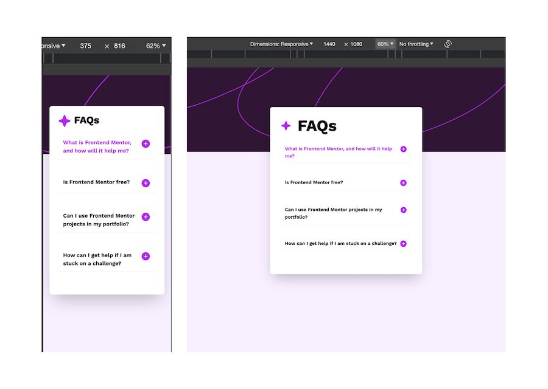
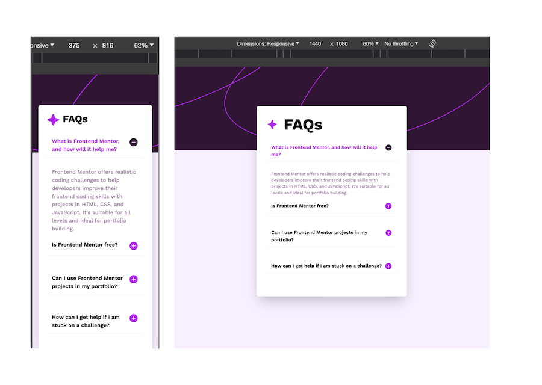

# Frontend Mentor - FAQ accordion solution

This is a solution to the [FAQ accordion challenge on Frontend Mentor](https://www.frontendmentor.io/challenges/faq-accordion-wyfFdeBwBz). Frontend Mentor challenges help you improve your coding skills by building realistic projects.

## Table of contents

- [Overview](#overview)
  - [The challenge](#the-challenge)
  - [Screenshot](#screenshot)
  - [Links](#links)
- [My process](#my-process)
  - [Built with](#built-with)
  - [What I learned](#what-i-learned)
  - [Continued development](#continued-development)
  - [Useful resources](#useful-resources)
- [Author](#author)
- [Acknowledgments](#acknowledgments)

## Overview

### The challenge

Users should be able to:

- Hide/Show the answer to a question when the question is clicked
- Navigate the questions and hide/show answers using keyboard navigation alone
- View the optimal layout for the interface depending on their device's screen size
- See hover and focus states for all interactive elements on the page

### Screenshot

### Links

- [Solution ](https://your-solution-url.com)
- [Live Site ](https://your-live-site-url.com)

## My process

### Built with

- Semantic HTML5 markup
- CSS custom properties
- Flexbox
- CSS Grid
- Mobile-first workflow
- [React](https://reactjs.org/) - JS library
- [ViteJs](https://vitejs.dev/)
- [tailwind](https://tailwindcss.com/) - for styles
- [daisyUI](https://daisyui.com/) - for styles

### What I learned

- Learnt how to add dynamic classes with Tailwind.
- Different ways to show the accordion answers.

### Continued development

- Still getting a hang of Tailwind and Daisy UI for styling.
- React never cease to impress.

### Useful resources

- [Google](https://www.google.com) - Yes, I google. My first move to a problem that I don't have any idea about. You should try it.

- [Stack Overflow](https://stackoverflow.com/) - This helps me always.I have come to realize that for any problem I encounter, I am not the first, stack overflow always has my back.

- [ReactJs](https://react.dev) - This helps me to work with different components seamlessly just as mentioned in their docs.Javascript all through.

- [Tailwind](https://tailwindcss.com) - This is the best way of styling in my opinion.

- [DaisyUi](https://daisyui.com) - This is the most popular component library for Tailwind CSS. It helps get more logical class names to Tailwind css.

- [Frontend Mentor](https://www.frontendmentor.io/resources) - On this platform there is a lot to learn always from the different solutions submitted as well as the rich resources curated.

## Author

- Website - [hcmwebs](https://www.hcmwebs.com)
- Frontend Mentor - [@hcmwebs](https://www.frontendmentor.io/profile/Hcmwebs)
- Twitter - [@hcmwebs](https://www.twitter.com/hcmwebs)

## Acknowledgments

- [Frontend Mentor](https://www.frontendmentor.io/) - Thank you very much for creating such a great platform.
